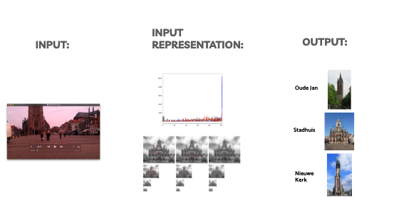
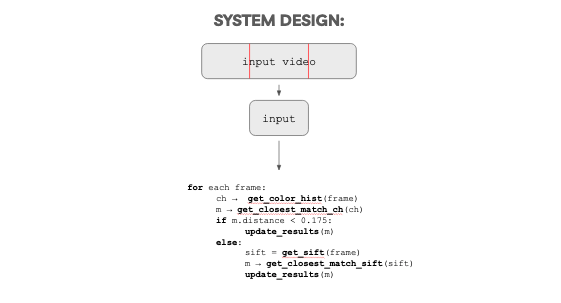
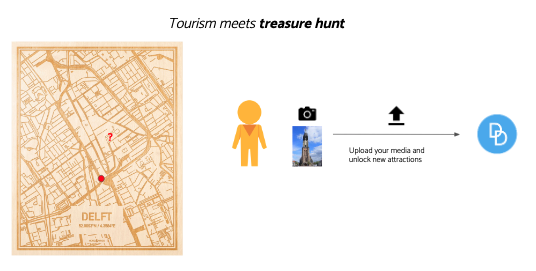

# Delft-Discover
CBIR System used to extrapolate the location of videos taken in Delft popular landmarks.

## System Description:
Given an input video, for each frame, we extract **Color Histogram** features and a set of **SIFT descriptors**. Each frame is checked against a background collection of images and contributes to the detection of the location where the video was taken.



## System Design:
Given an input video, it is splitted in three parts, and only the middle portion of the video is analyzed. This assumption is based on the fact the middle portion is the one with the highest chance of containing a clear view of the monument. At this point, for each frame, the color histogram is computed and the frame is classified based on that. If the match has a satisfying accuracy, the next frame is considered, otherwise, SIFT is used to classify the frame.



## Use case:



## Usage:

### Create the Database
First, you need to create a local database to index the images based on color histogram and SIFT features. In order to do that, go in the `src` folder and use the `dbt.py` tool: 

```
python dbyt.py --help

usage: dbt.py [-h] [--database DATABASE] [--prefix PREFIX]
              [--clusters CLUSTERS]
              feature training_set

Database tool creates features and Visual Bag of Words database for a
specified training set of images.

positional arguments:
  feature               The type of features you want to generate. Chose from
                        ['sift', 'colorhist']
  training_set          Path to training images.

optional arguments:
  -h, --help            show this help message and exit
  --database DATABASE, -d DATABASE
                        Optional output name for the database
  --prefix PREFIX, -p PREFIX
                        prefix path to database directory, default = 'db/'
  --clusters CLUSTERS, -c CLUSTERS
                        Number of clusters for K-Means clustering algorithm'
```

You are going to need the databases for both `colorhist` and `sift`

```
python dbt.py -d colorHist ../images colorhist

python dbt.py -d SIFT ../images sift
```


### Discover

```
python discover.py --help

usage: discover.py [-h] database_colorhist database_sift query

Query tool to query the database created by the database tool (dbt.py).
Retrieve images based on image content and metadata.

positional arguments:
  database_colorhist  Path to the database of the colorhist features
  database_sift       Path to the database of the sift features
  query               Query Video

optional arguments:
  -h, --help          show this help message and exit
```

### Example
``` 
python discover.py ./db/colorHist.db ./db/SIFT.db ./videoqueries/VIDEO0191.3gp
```